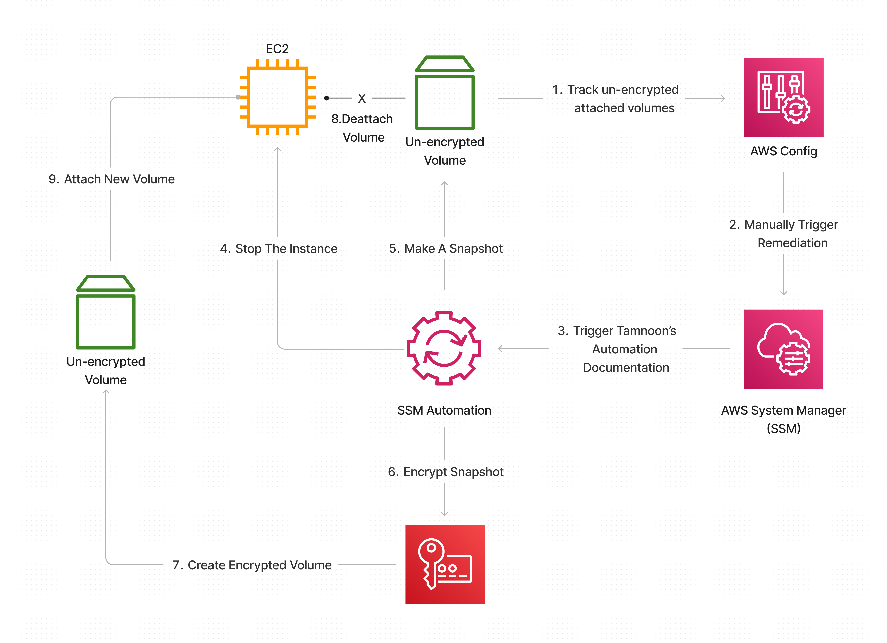

# Tamnoon Automatically Remediates Unencrypted EBS Volumes Using KMS keys.

This playbook describes how to remediate unencrypted EBS Volumes automatically. 
Amazon EBS encrypted volumes provide an additional layer of data protection by securing your data from unauthorized access to the underlying storage.
You can use Amazon EBS encryption to increase the data protection of your applications deployed in the cloud and to fulfill compliance requirements for encryption at rest.

Playbook steps:
1. Deploy an automated process to detect unencrypted EBS volumes and facilitate their remediation:
   1. AWS Config Rule - To monitor for unencrypted EBSs in the deployed region
   2. AWS System Manager Automation - To handle remediation for each noncompliant resource:
      1. Stop Instance
      2. Create a volume snapshot
      3. Create an encrypted copy of the unencrypted snapshot 
      4. Create a new volume from the encrypted snapshot
      5. Detached the unencrypted volume
      6. Attach the new encrypted volume
      7. Restart Instance
2. Enable EBS encryption as default over all the accounts (from now on, on each enabled account, the creation of a new instance will include encrypted EBS volume automatically).
3. Add SCP Deny policy for creation instance with unencrypted EBS (applicable to environments with AWS Organization).

## Prerequisites 
A workstation with both AWS CLI and jq installed (https://stedolan.github.io/jq/download/).
IAM permissions are provisioned to have read and write access to CloudFormation, EC2, Systems Manager, Config, & KMS.
AWS Organizations configured with all features enabled, a requirement for Service Control Policies.
AWS Config enabled in the target accounts ensuring there are no Config rules in your AWS accounts with the name "encrypted-volumes." This solution deploys an AWS Config rule with this name. Existing Config rules with this name may fail the deployment. This can also result in unnecessary charges related to processing the same AWS Config rule more than once.
AWS Systems Manager must be enabled to view the status of the remediation automation

## Notes:
* If the instance is public facing without a static public IP assigned, The instance will get a new public IP after creation. In that case, you will need to all the users and resources that rely on the old public IP to the new public IP.
* This playbook is Region-specific - The monitoring and remediation automation will be deployed to a specific region. Also, the `enable-encryption-by-default` configuration becomes compulsory for all new resources in a given region. If you enable this setting for a Region, individual volumes or snapshots in that Region cannot be exempted.
* If you are using pre-existing KMS key for the remediation you should - 
  * Run the CloudFormation template
  * Update the KMS key policy to include this role arn in the usage list:
    * Go to the KMS console on the specific region
    * Double-click your KMS id 
    * Go to Key users and click Add
    * look for the Role with name "EncryptionRemediationRole-" for that specific region and add it to the key users 

##Automation Stack 
### Limitations
1. For resources that are managed by Auto Scaling Group (EKS,ECS ...), please refer to the Auto Scaling Group remediation part of the playbook.
2. Although there is no direct way to encrypt existing unencrypted volumes, you can create snapshots of the unencrypted volumes and launch new encrypted volumes from the snapshots.
3. This solution encrypts all EBS volumes with the same AWS KMS.

### Deployment
* In case no KMS arn provided, a new KMS CMK will be created as a part of this automated solution. Identify an IAM User or Role that will be the Key Admin for the new CMK. If a new user or role needs to be created for this purpose, create it now.
  * Once identified, copy the user or role's ARN and keep it handy as it will be used during the deployment.
* Deploy the attached _EBSEncryptionAutomation.yaml_ in CloudFormation. Give the stack a clear and descriptive name and provide either the KMS Arn or the User arn from the previous step to manage the newly generated key.
* After the stack was deployed, in case you provide arn for KMS Key to use, go to the KMS dashboard and edit the Key policy configuration - Add the IAM Role that just generated with the name - _EncryptionRemediationRole_ as on eof the Key users

### Usage
* In the AWS Console, go to Services -> Config > Rules. Select the Rule 'encrypted-volumes'. A list of non-compliant resources will be listed. The Config rule is set to detect resource changes and will trigger shortly after the instance and volume are created.
    * Select the resource, then click "Remediate."
    * You can view the progress and status in the Systems Manager. In the console, go to "Systems Manager" -> "Automation." Select the 'Execution ID' of the corresponding automation to view further details.

### Auto Scaling Group Remediation Section (Cover ECS/EKS)
In case of an instance that is managed by Auto Scaling Group (for example, ECS/EKS or stand-alone ASG)
Follow the next steps:
1. Enable encryption by default for that account and region - This will prevention for scaling up an unencrypted instance
2. To remediate the existing running instance, You need to suspend the health check process from the Auto Scaling Group:
   1. Open the Amazon EC2 console.
   2. In the navigation pane, under Auto Scaling, choose Auto Scaling Groups.
   3. Select the group of the instances that you want to remediate.
   4. Under Advanced configuration, click edit.
   5. Under Suspended process, choose Health Check and click update 
3. Execute the remediation against the instance on this Auto Scaling Group and wait until the Instance is back to its initiate state.
4. Turn back the Health check process under the Auto Scaling Group

## Enforce Service Control Policies

Navigate to AWS Organizations and create a new Service Control Policy. Add the contents of _DenyUnencryptedEC2.json_ to the policy and save it. Apply this policy to the organization Root or any necessary OUs.

[SCP](SCP)

## Enable Default EBS Encryption

For each account and region in scope, run the _enable-ebs-encryption-for-account.sh_ script from your workstation.
The script receives two parameters - 
1. AWS KMS key_id to use as the default key for default EBS encryption's - MANDATORY
2. AWS profile (OPTIONAL)

[Bash](Bash)

  