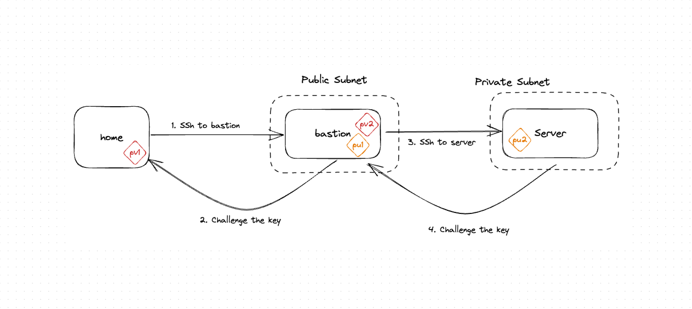
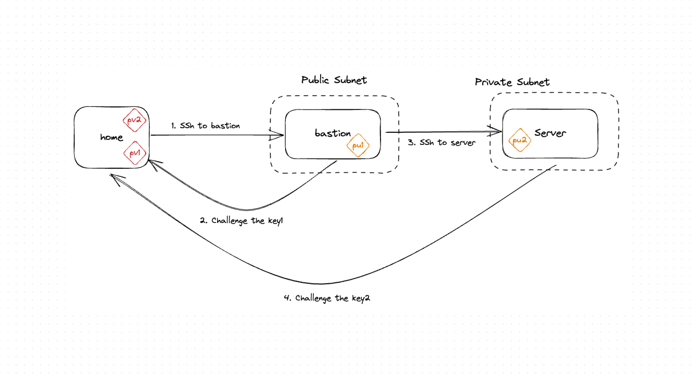
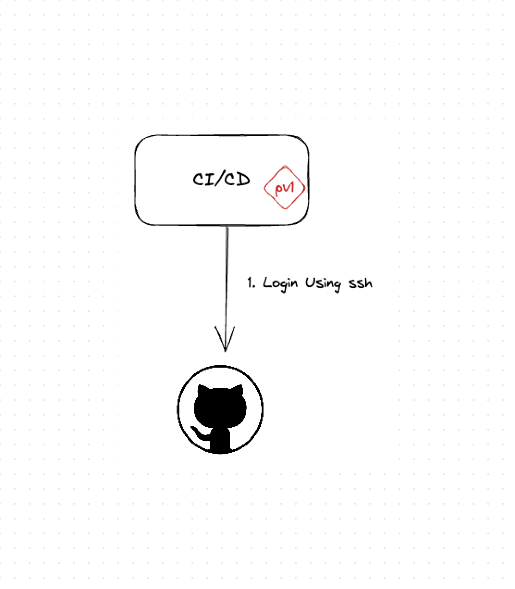
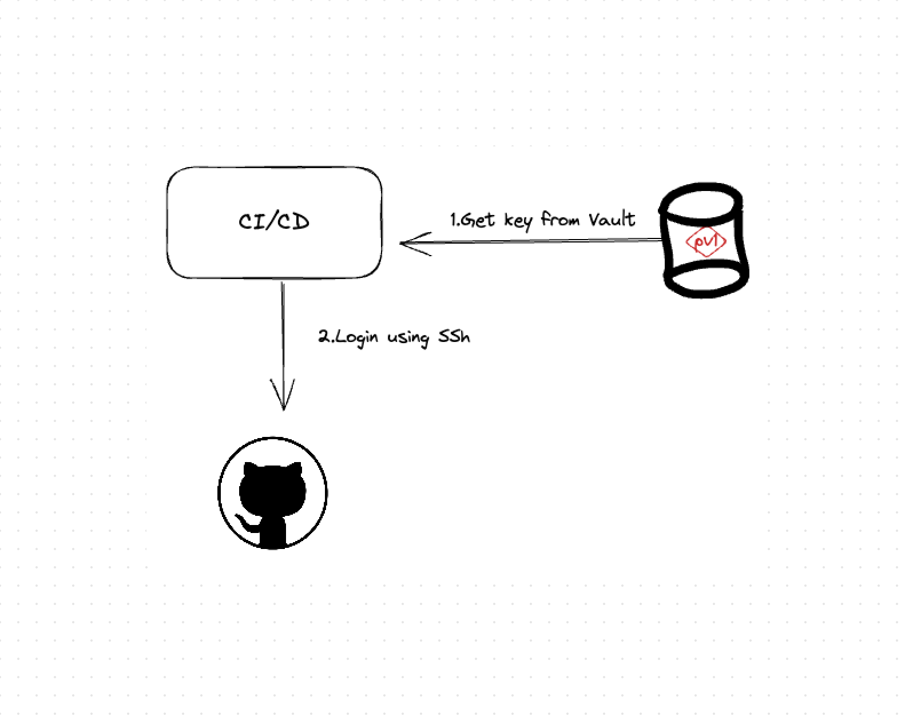

# Tamnoon Playbook: Handle SSH clear text outside from the server.

## Description
This playbook will help you to better handle SSH private keys, and not stored them on the server file system.

### Cloud Lateral Movement Risk
Preventing cloud lateral movement is of utmost importance as it safeguards the integrity and security of our cloud infrastructure. By proactively mitigating the risk of unauthorized movement within our network, we significantly reduce the potential for data breaches, privilege escalation, and unauthorized access to critical resources. Minimizing lateral movement ensures the protection of sensitive information, enhances the trust of our customers, and maintains the availability and reliability of our cloud services. By adopting robust security measures and closely monitoring network activity, we can effectively thwart cyber threats and maintain a secure cloud environment.
    
[Wiz Blog] - https://www.wiz.io/blog/lateral-movement-risks-in-the-cloud-and-how-to-prevent-them-part-1-the-network-layer

### Use cases

#### Bastion Server (Jump Box)
A bastion server, also known as a jump box or a jump server, is a highly secured computer system that acts as an intermediary between a trusted internal network and an external network, such as the internet. It is designed to provide controlled and secure access to the internal network, especially for administrators or authorized users who need to manage or access systems within the network.

By using a bastion server, organizations can enforce a central point of entry for accessing their internal network, reducing the attack surface and the risk of unauthorized access. It helps protect critical systems and sensitive data by adding an extra layer of security and control to the network infrastructure.

Improper configuration of a bastion server can pose risks. One such example is the unsafe practice of storing private keys for targeted servers directly on the bastion server. This can potentially expose the organization to lateral movement attacks.

 
##### Solution
A recommended practice is to store all private keys locally and utilize SSH agent forwarding.
1. Add Keys to ssh-agent

    ``ssh-add <path to the key>``

   ``On mac - ssh-add -K <path to the key>``
2. SSH to the bastion server and allow forwarding 
    
    ``ssh -i <bastion private key> -A <bastion user>@<bastion public ip>``
3. On the bastion server, SSH to the target server.

    ``ssh <server_user>@<server ip>``

 

#### Application Server 
In certain scenarios, an application server requiring access to other services may store SSH keys internally within the server itself. For instance, a CI/CD process that utilizes SSH to log in to Git repositories.

##### Solution
To enhance security and management of sensitive credentials, it is advisable to utilize Vault and leverage plugins available within CI/CD frameworks.

[Jenkins HashiCorp Vault] - https://plugins.jenkins.io/hashicorp-vault-plugin/

[Jenkins AWS Secret Manager] - https://plugins.jenkins.io/aws-secrets-manager-credentials-provider/

[Jenkins Azure Vault] - https://plugins.jenkins.io/azure-keyvault/

[Travis CI HashiCorp Vault] - https://docs.travis-ci.com/user/hashicorp-vault-integration

[AWS Secret Helper Tool] - https://github.com/awslabs/secrets-helper

[CircleCI HashiCorp Vault] - https://circleci.com/blog/oidc-with-vault/

[CircleCI AWS Secret Manager] - https://circleci.com/developer/orbs/orb/pathmotion/aws-secrets-manager

[GitLab HashiCorp] - https://docs.gitlab.com/ee/ci/secrets/id_token_authentication.html#automatic-id-token-authentication-with-hashicorp-vault

