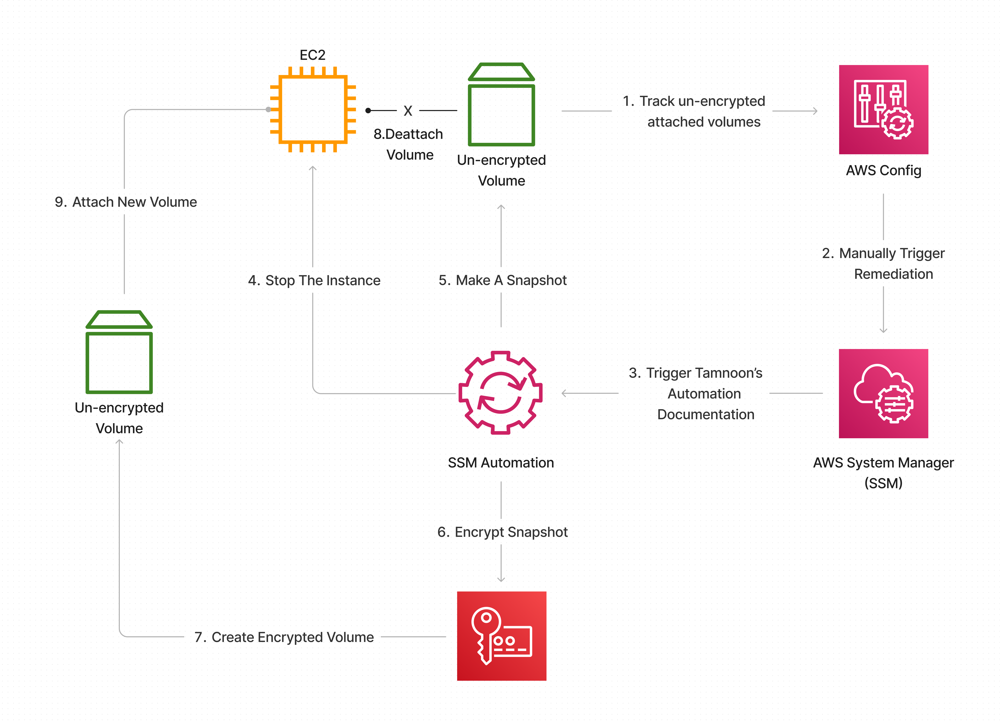

# Tamnoon Automatically unencrypted EBS Volumes remediation using KMS keys.

This playbook describes how to remediate unencrypted EBS Volumes automatically. 
Amazon EBS encrypted volumes provide an additional layer of data protection by securing your data from unauthorized access to the underlying storage.
You can use Amazon EBS encryption to increase the data protection of your applications deployed in the cloud and to fulfill compliance requirements for encryption at rest.

Playbook steps:
1. Deploy an automated process to trace unencrypted EBS and Automated remediation:
   1. AWS Config Rule - To trace unencrypted EBSs in the deployed region
   2. Aws System Manager Automation - To handle remediation for each uncompliant resource:
      1. Stop Instance
      2. Create a volume snapshot
      3. Encrypt Snapshot
      4. Detached un encrypted volume
      5. Attach new encrypted volume
      6. Restart Instance
2. Enable EBS encryption as default over all the accounts (from now on, on each enabled account, the creation of a new instance will include encrypted EBS volume automatically).
3. Add SCP Deny policy for creation instance with unencrypted EBS.

## Prerequisites 
A workstation with both AWS CLI and jq installed (https://stedolan.github.io/jq/download/).
IAM permissions are provisioned to have read and write access to CloudFormation, EC2, Systems Manager, Config, & KMS.
AWS Organizations configured with all features enabled, a requirement for Service Control Policies.
Config enabled in the target accounts ensuring there are no Config rules in your AWS accounts with the name "encrypted-volumes." This solution deploys an AWS Config rule with this name. Existing Config rules with this name may fail the deployment. This can also result in unnecessary charges related to processing the same AWS Config rule more than once.

## Notes:
* If the instance is public facing without a static public IP assigned, The instance will get a new public IP after creation. In that case, you need to sync all the assets/users that rely on that with the new IP.
* This playbook is Region-specific - The tracing and remediation automation will deploy to a specific region. Also, the enable encryption by default configuration is Region-specific. If you enable it for a Region, you cannot disable it for individual volumes or snapshots in that Region.
* If you are using pre-existing KMS key for the remediation you should - 
  * Run the Cloud formation template
  * Update the KMS key policy - Add this role arn to the usage list:
    * Go to the KMS console on the specific region
    * Double-click your KMS id 
    * Go to Key users and click Add
    * look for the Role with name "EncryptionRemediationRole-" for that specific region and add it to the key users 

## Automation Stack 
### Limitations
1. Not working straightforwardly with EKS - please refer to - EKS Workaround later on this doc.
2. Although there is no direct way to encrypt an existing unencrypted volume or snapshot, you can encrypt them by creating either a volume or a snapshot. This pattern provides automation to remediate your unencrypted EBS volumes.
3. This solution encrypts all EBS volumes with the same AWS KMS.

### Deployment
* In case no KMS arn provided, a new KMS CMK will be created as part of this pattern. Identify an IAM User or Role which will be the Key Admin for the new CMK. If a new user or role needs to be created for this purpose, create it now.
  * Once identified, copy the user or role's ARN and keep it handy as it will be used during the deployment.
* Deploy the attached _EBSEncryptionAutomation.yaml_ in CloudFormation. Give the stack a clear and descriptive name and provide either the KMS Arn or the User arn from the previous step to manage the newly generated key.
* After the stack was deployed, in case you provide arn for KMS Key to use, go to the KMS dashboard and edit the Key policy configuration - Add the IAM Role that just generated with the name - _EncryptionRemediationRole_ as on eof the Key users

### Usage
* In the AWS Console, go to Services -> Config > Rules. Select the Rule 'encrypted-volumes'. A list of non-compliant resources will be listed. The Config rule is set to detect resource changes and will trigger shortly after the instance and volume are created.
    * Select the resource, then click "Remediate."
    * You can view the progress and status in the Systems Manager. In the console, go to "Systems Manager" -> "Automation." Select the 'Execution ID' of the corresponding automation to view further details.

### EKS Workaround
In the case of EKS, using Node Group Manager - this automated remediation is not enough. The next steps suggested as a workaround:
1. Add the node group's IAM Role to the KMS policy as a user 
2. Enable encryption by default for that account and region 
3. Execute the remediation and wait until the node group creates a new instance with encrypted volume.

## Enforce Service Control Policies

Navigate to AWS Organizations and create a new Service Control Policy. Add the contents of _DenyUnencryptedEC2.json_ to the policy and save it. Apply this policy to the organization Root or any necessary OUs.

[SCP](SCP)

## Enable Default EBS Encryption

In each account and region in use, run _enable-ebs-encryption-for-account.sh_ script from your workstation.
The script recive two parameters - 
1. AWS KMS key_id to use as the default key for default EBS encryption's - MANDATORY
2. AWS profile (OPTIONAL)

[Bash](Bash)

  
